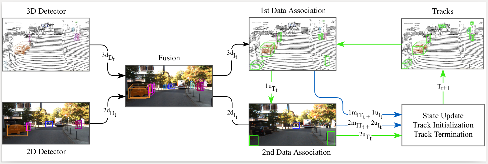

# EagerMOT: 3D Multi-Object Tracking via Sensor Fusion

### Read our ICRA 2021 paper [here](https://arxiv.org/abs/2104.14682) or this [3 minute video](https://youtu.be/RX4xDQ0YXxE) for a quick intro or [the full presentation video](https://youtu.be/k8pKpvbenoM) for more details.

Improve your online 3D multi-object tracking performance by using 2D detections to support tracking when 3D association fails. The method adds minimal overhead, does not rely on dedicated hardware on any particular sensor setup. The current Python implementation run at **90 FPS** on KITTI data and can definitely be optimized for actual deployment.

The framework is flexible to work with any 3D/2D detection sources (we used only off-the-shelf models) and can be extended to other tracking-related tasks, e.g. MOTS.

### 3D results: [](https://paperswithcode.com/sota/3d-multi-object-tracking-on-kitti?p=eagermot-3d-multi-object-tracking-via-sensor) [](https://paperswithcode.com/sota/3d-multi-object-tracking-on-nuscenes?p=eagermot-3d-multi-object-tracking-via-sensor)

### 2D results: [](https://paperswithcode.com/sota/multiple-object-tracking-on-kitti-tracking?p=eagermot-3d-multi-object-tracking-via-sensor) [](https://paperswithcode.com/sota/multi-object-tracking-and-segmentation-on-1?p=eagermot-3d-multi-object-tracking-via-sensor)

This repo contains code for our ICRA 2021 paper. Benchmark results can be fully reproduced with minimal work, only need to edit data location variables. If desired, our ablation results can also be reproduced by need more adjustments. 

An earlier version of this work has also appeared as a short [4-page paper](https://motchallenge.net/workshops/bmtt2020/papers/EagerMOT.pdf) at the [CVPR 2020 MOTChallenge Workshop](https://motchallenge.net/workshops/bmtt2020/).


## Abstract
Multi-object tracking (MOT) enables mobile robots to perform well-informed motion planning and navigation by localizing surrounding objects in 3D space and time. Existing methods rely on depth sensors (e.g., LiDAR) to detect and track targets in 3D space, but only up to a limited sensing range due to the sparsity of the signal. On the other hand, cameras provide a dense and rich visual signal that helps to localize even distant objects, but only in the image domain. In this paper, we propose EagerMOT, a simple tracking formulation that eagerly integrates all available object observations from both sensor modalities to obtain a well-informed interpretation of the scene dynamics. Using images, we can identify distant incoming objects, while depth estimates allow for precise trajectory localization as soon as objects are within the depth-sensing range. With EagerMOT, we achieve state-of-the-art results across several MOT tasks on the KITTI and NuScenes datasets.



## Benchmark results

Our current standings on **KITTI** for 2D MOT on [the official leaderboard](http://www.cvlibs.net/datasets/kitti/eval_tracking.php). For 2D MOTS, see [this page](http://www.cvlibs.net/datasets/kitti/eval_mots_detail.php?result=714550ab34eca8356b2163f8c18c246ec18fbf0b). 
Our current standings on **NuScenes** for 3D MOT on [the official leaderboard](https://www.nuscenes.org/tracking?externalData=all&mapData=all&modalities=Any).

## How to set up

Download official NuScenes and KITTI data if you plan on running tracking on them. Change the paths to that data in `configs/local_variables.py`. 

Also set a path to a working directory for each dataset - all files produced by EagerMOT will be saved in that directory, e.g. fused instances, tracking results. A subfolder will be created for each dataset for each split, for example, if the working directory is `/workspace/kitti`, then `/workspace/kitti/training` and `/workspace/kitti/testing` will be used for each data split. 

The data split to be run is specified in `local_variables.py`. For example, for KITTI, the `SPLIT` variable with be either `training` or `testing`. For NuScenes, in addition to changing the name of the `SPLIT` (train/val/test/mini-train/...), the version of the dataset (`VERSION = "v1.0-trainval"`) also has to be modified in `run_tracking.py` when switching between train/test. 

If running on KITTI, download `ego_motion.zip` from the [drive](https://drive.google.com/drive/folders/1MpAa9YErhAZNEJjIrC4Ky21YfNj2jatM?usp=sharing) and unzip it into the KITTI working directory specified above (either training or testing). NuScenes data is already in world coordinates, so no need to ego motion estimates.

### Download 3D and 2D detections, which ones to download depends on what you want to run:
We thank other researchers for opening their code and data to the community and therefore provide links to their data directly in hopes that you will also check out their great work! 
Data that was not available directly but was generated by us using their open source code is given through a cloud download link.

* KITTI 2D MOTSFusion detections/segmentations from https://github.com/tobiasfshr/MOTSFusion. Under the "Results" section, they provide link to download their detections.
* KITTI 2D TrackRCNN detections/segmentations from https://www.vision.rwth-aachen.de/page/mots. Under the "Downloads" section they provide a link to download detections.
* KITTI 3D [PointGNN](https://github.com/WeijingShi/Point-GNN), NuScenes 3D [CenterPoint](https://github.com/tianweiy/CenterPoint), NuScenes 2D detections using an [MMDetection](https://github.com/open-mmlab/mmdetection) model from the [drive](https://drive.google.com/drive/folders/1MpAa9YErhAZNEJjIrC4Ky21YfNj2jatM?usp=sharing).  
* NuScenes 3D CenterPoint detections can also be downloaded directly from [the author's page](https://github.com/tianweiy/CenterPoint/blob/master/configs/nusc/README.md) for the `centerpoint_voxel_1440_dcn(flip)` config.
NuScenes 2D MMDetection output was obtained using the `cascade_mask_rcnn | X-101_32x4d` model given in [the model zoo](https://github.com/open-mmlab/mmdetection3d/tree/master/configs/nuimages). See issue #9 for more details.
* KITTI 3D AB3DMOT detections can be downloaded from the original source https://github.com/xinshuoweng/AB3DMOT, but their format has recently changed and is no longer compatible with this repo. The detections provided in the above cloud link are simpy a copy downloaded at an earlier time when this the parsing code in this repo was written.

Our best benchmark results were achieved using detections from 3D PointGNN + (2D MOTSFusion+RRC) for KITTI and 3D CenterPoint + 2D MMDetectionCascade for NuScenes.

Unzip detections anywhere you want and provide the path to the root method folder in the `inputs/utils.py` file. 

**NOTE**: If using MOTSFusion input, also run the `adapt_kitti_motsfusion_input.py` script to copy the necessary detection information to its segmentation file.  

### Set up a virtual environment
* if using conda: 
```
conda create --name <env> --file requirements_conda.txt
```
* if using pip: 
```
python3 -m venv env
source env/bin/activate
pip install -r requirements_pip.txt
```


## How to run
See `run_tracking.py` for the code that launches tracking. Modify which function that file calls, depending on which dataset you want to run. See nearby comments for instructions.
```py
if __name__ == "__main__":
    # choose which one to run, comment out the other one
    run_on_nuscenes()  
    run_on_kitti()
```
Start the script with `$python run_tracking.py`. Check the code itself to see what is being called. I recommend following function calls to explore how the code is structured.

Overall, the code was written to allow customization and easy experimentation instead of optimizing for performance. 

Soon, I am looking to extract the data loading module and push my visualization code into a separate repo to use for other projects.

## Please cite our paper if you find the code useful
```
@inproceedings{Kim21ICRA,
  title     = {EagerMOT: 3D Multi-Object Tracking via Sensor Fusion},
  author    = {Kim, Aleksandr, O\v{s}ep, Aljo\v{s}a and Leal-Taix{'e}, Laura},
  booktitle = {IEEE International Conference on Robotics and Automation (ICRA)},
  year      = {2021}
}
```

Also, please check out the related work cited in our paper for other interesting research that might interest you.


